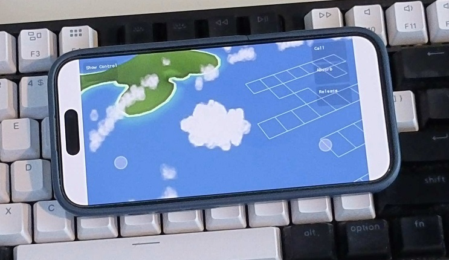

> [!WARNING]
> This repository contains no assets, only code. You will need to provide the original game assets for it to work.

ThatCloudEngine is a game engine I wrote that can run assets from the [ThatCloudGame](http://www.thatcloudgame.com/). I discovered Cloud while I was a teenager, and it became one of my comfort games and an inspiration to my career.

Yet, I wanted to be able to play it on more devices. I realized that most of the assets are in known formats, so I could “just” reimplement the engine. And I added touch control to play it on my phone. 

